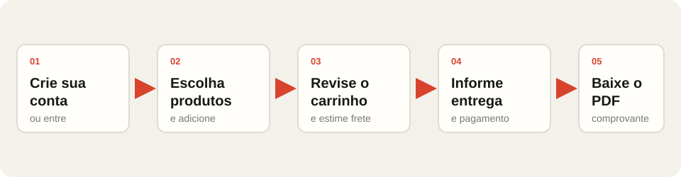
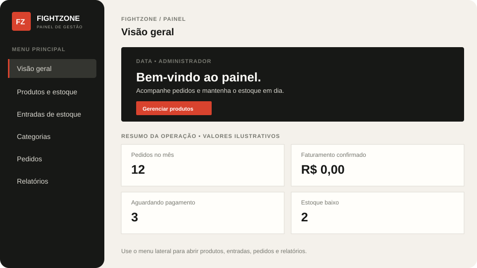

# FightZone

Loja de artigos de boxe em PHP, MySQL e CSS, organizada em MVC. Este guia mostra como iniciar o projeto e usar as partes principais.

## 1. Iniciar no XAMPP

1. Deixe a pasta do projeto em `C:\xampp\htdocs\fightzone`.
2. Abra o XAMPP Control Panel e inicie **Apache** e **MySQL**.
3. Acesse o phpMyAdmin em [http://localhost/phpmyadmin](http://localhost/phpmyadmin).
4. Importe `database/fightzone.sql`. O script prepara/atualiza a estrutura do banco `fightzone` sem apagar os produtos existentes.
5. Confira `config/db.php`. No XAMPP padrão, a conexão usa `localhost`, usuário `root`, senha vazia e banco `fightzone`.
6. Abra a loja em [http://localhost/fightzone/](http://localhost/fightzone/).

## 2. Usar a loja como cliente

1. Na loja, clique em **Entrar**. Use **Criar conta** para cadastrar um cliente.
2. Preencha nome, e-mail e senha. O cadastro público cria somente contas de cliente.
3. Na tela **Entrar**, clientes, vendedores e administradores usam o e-mail e a senha da conta. Clientes seguem para a loja; usuários `admin` ou `vendedor` seguem para o painel da equipe.
4. Após entrar como cliente, adicione produtos ao carrinho.
5. No carrinho, ajuste quantidades e calcule a estimativa de frete pelo CEP.
6. Continue para entrega, informe o endereço e escolha a forma de pagamento para registrar o pedido.
7. Após concluir, acompanhe o andamento em **Meus pedidos**, disponível no menu da loja enquanto estiver conectado. A lista mostra o status, os itens, a entrega e o link para o resumo do pedido.
8. A previsão exibida é ilustrativa: sete dias úteis contados da criação do pedido, sem considerar feriados nem prazo de transportadora. O sistema não recebe atualizações de rastreio.
9. Enquanto o pedido estiver aguardando pagamento, é possível cancelá-lo em **Meus pedidos**. O cancelamento atualiza o status e devolve os itens ao estoque; pedidos pagos ou em preparação não podem ser cancelados pelo cliente.



## 3. Acessar o painel da equipe

Na loja, clique em **Entrar** no menu ou acesse diretamente:

[http://localhost/fightzone/index.php?controller=cliente&action=index](http://localhost/fightzone/index.php?controller=cliente&action=index)

Essa é a tela única de login: clientes entram na loja, enquanto contas ativas com perfil `admin` ou `vendedor` entram no painel da equipe. A autorização depende do perfil registrado em `usuarios`, não apenas de conhecer um e-mail. O cadastro público cria somente contas de cliente.

### Conta administrativa para apresentação

O script `database/fightzone.sql` cria/atualiza uma conta administrativa para a demonstração:

- **E-mail:** `GerenteFZ@gmail.com`
- **Senha:** `12345678`

Importe o script e use essas credenciais na tela **Entrar**. A senha não fica salva em texto puro no SQL: o script armazena seu hash. A inserção atualiza essa conta caso o mesmo e-mail já exista; não use essa senha em produção e altere-a se o projeto for publicado.

Para criar outra conta administrativa, gere um hash de senha no PowerShell:

```powershell
C:\xampp\php\php.exe -r "echo password_hash('SUA_SENHA_FORTE', PASSWORD_DEFAULT), PHP_EOL;"
```

No phpMyAdmin, selecione `fightzone` e execute um `INSERT` na tabela `usuarios` com o nome, e-mail, hash gerado, perfil `admin`, `ativo` igual a `1` e `created_at` igual a `NOW()`. O cadastro público cria somente contas de cliente.

### Redefinir a senha manualmente

Não há recuperação automática de senha pela tela de login. Para definir uma senha nova, gere um hash pelo comando acima e atualize a conta no phpMyAdmin:

```sql
UPDATE usuarios
SET senha = 'COLE_AQUI_O_HASH', ativo = 1
WHERE email = 'admin@exemplo.com'
  AND perfil IN ('admin', 'vendedor');
```

Depois entre com o mesmo e-mail e a senha que gerou o hash.

## 4. O que fazer no painel



*Ilustração esquemática; os valores mostrados são apenas exemplos.*

- **Visão geral:** veja pedidos do mês, faturamento marcado como pago, pedidos aguardando pagamento, produtos com estoque baixo e quantidade de produtos ativos.
- **Produtos e estoque** *(admin)*: cadastre/edite produtos, preço, quantidade, peso e dimensões; envie foto JPG, PNG ou WebP de até 5 MB. Remover um produto o deixa inativo, preservando o histórico.
- **Entradas de estoque** *(admin)*: registre reposições; o sistema atualiza a quantidade e mantém o histórico.
- **Categorias** *(admin)*: cadastre ou desative categorias da loja.
- **Pedidos:** consulte pedidos, cliente, forma de pagamento, situação e total.
- **Relatórios:** consulte os dados por período.
- Use **Sair** no canto inferior do painel ao terminar.

Para cadastrar um produto, informe também medidas e peso do pacote para envio. As medidas são em centímetros e o peso em quilos. Uma foto é opcional; sem foto, o catálogo mostra um marcador FightZone.

## 5. O que é estimado e o que precisa de integração

- O frete atual é uma **estimativa local** baseada no CEP, peso e dimensões; não é cotação oficial de transportadora. O ViaCEP pode preencher o endereço sem chave de API.
- A chave PIX aleatória configurada localmente em `config/pagamento.local.php` aparece no checkout e na confirmação do pedido. Esse arquivo é ignorado pelo Git. Confira o destinatário e o valor no aplicativo do banco; o projeto **não gera uma cobrança PIX nem confirma pagamentos automaticamente**.
- A seleção de PIX, cartão ou boleto registra a preferência no pedido, mas não processa nem confirma o pagamento. O status e a previsão em **Meus pedidos** são os dados registrados pelo sistema; não há confirmação automática de pagamento nem integração de rastreio.
- Ao registrar o pedido, o sistema já baixa os itens do estoque, mesmo enquanto o pagamento está pendente. Acompanhe esses pedidos na seção **Pedidos**.
- O PDF tem um visual demonstrativo inspirado em DANFE, mas informa claramente que **não é uma NF-e, não comprova pagamento e não tem valor fiscal**. Para emitir uma NF-e real, integre um emissor fiscal autorizado.

## Estrutura principal

- [Manual completo em PDF](docs/manual-projeto-fightzone.pdf): documentação preparada para impressão.
- `controllers/`: fluxo da loja, contas e painel.
- `models/`: acesso a dados do MySQL.
- `views/`: páginas HTML/PHP.
- `public/assets/`: CSS e imagens da loja/painel.
- `database/fightzone.sql`: estrutura e atualização do banco.
